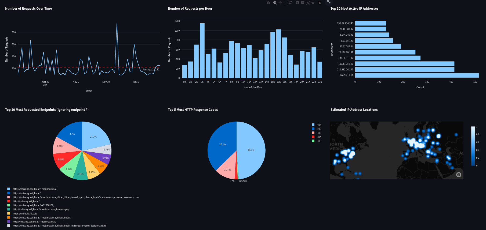
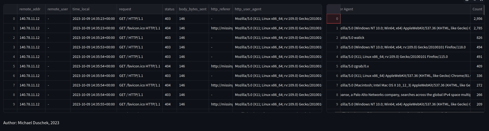

# Nginx Log Visualizer

Data visualization of nginx logs in real time and accessible in the browser.

## What is visualized?
- Traffic Overview
  - Number of requests over time (line chart)
  - IP address location plotted on a map
  - traffic by hour/day/week
- Top Requested URLs or Endpoints
- Response Codes
- User Agents
- Most active IP addresses (pie chart)

## What could be visualized in the future?

- Most active Countries
- Error Types
- Error Trends over time (line chart)
- Top Error Sources/IPs
- Error Response Times

- Total nr. of requests, errors
- Table with all requests
- Distinct remote IP addresses

## IP Geolocation

To retrieve IP Geolocation data, ipgeolocation.io is used. 
Due to the limited amount of only 30k requests per month (and 1k a day), 
a sqlite3 database is used to cache ip geolocation data that was requested before. 

## Disclaimer
This project was part of the lecture "Missing Semester" at Johannes Kepler University.

Author: Michael Duschek

## Execution
- cd to the root directory of this project
- add your IPGEOLOCATION API key to .env: `IP_GEOLOCATION_KEY=<yourKey>`
- Optional: create virtual environment, conda or pipenv and activate it
- run `pip install -r requirements.txt` 
- run the command `streamlit run nginx-visualizer.py` in terminal
- Browser: open http://localhost:8501/

## Requirements
- nginx service with logfiles logging to `/var/log/nginx`
- or logfiles in the root directory of this project under `./nginx/`